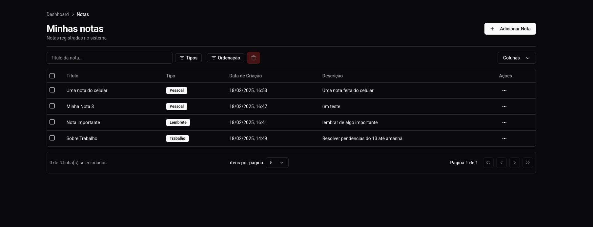

# Gestão de Notas  - App

Um aplicativo de gestão de notas com capacidade de criar, editar, remover e pesquisar notas. O projeto funciona com uma API externa desenvolvida em Nest.js para o servidor. Os usuários podem se logar e registrar no website para ter acesso às funcionalidades.



## 🔗 Demonstração

- Aplicação (demo): [Gestão de Notas](https://w-client.vercel.app/)
- API Externa (Nest JS): [Repositório da API](https://github.com/Brunogomes97/w_server)

## 🚀 Tecnologias Utilizadas

- [Next.js](https://nextjs.org/) - Framework para React
- [React](https://react.dev/) - Biblioteca para criação de interfaces
- [Tailwind CSS](https://tailwindcss.com/) - Estilização
- [TanStack Query](https://tanstack.com/query/latest) - Gerenciamento de estados assíncronos
- [TanStack Table](https://tanstack.com/table/latest) - Tabela avançada
- [Shadcn/ui](https://ui.shadcn.com/) - Design System e Componentes estilizados
- [React Hook Form](https://react-hook-form.com/) - Gerenciamento de formulários
- [Zod](https://zod.dev/) - Validação de formulários

## 📦 Instalação e Configuração

### Pré-requisitos

Antes de começar, certifique-se de ter instalado:

- [Node.js](https://nodejs.org/)

### Clonando o Repositório

```bash
git clone https://github.com/Brunogomes97/w_client.git
cd w_client
```

### Instalando Dependências

```bash
npm install
# ou
yarn install
```

### Configurando Variáveis de Ambiente

Crie um arquivo `.env` na raiz do projeto e adicione as variáveis necessárias:

```env
API_URL=https://sua-api.com
```

### Rodando a Aplicação

Para rodar em ambiente de desenvolvimento:

```bash
npm run dev
# ou
yarn dev
```

Para rodar em produção:

```bash
npm run build && npm start
```

## 🖥️ Estrutura do Projeto

```
📚 W_CLIENT
 ┓ 📚 .next            # Build gerada pelo Next.js
 ┓ 📚 app             
 ┗ ┓ 📚 (pages)        # Páginas da aplicação
    ┓ 📄 actions.ts    # Ações do servidor
    ┓ 📄 globals.css   # Estilos globais
    ┓ 📄 layout.tsx    # Layout principal
    ┓ 📄 page.tsx      # Página principal
 ┓ 📚 components      # Componentes reutilizáveis
 ┓ 📚 hooks           # Hooks customizados
 ┓ 📚 lib             # Funções utilitárias
 ┓ 📚 node_modules    # Dependências do projeto
 ┓ 📚 public          # Arquivos estáticos
 ┓ 📚 services        # Comunicação com API externa
 ┓ 📄 .env            # Variáveis de ambiente
 ┓ 📄 .gitignore      # Arquivos ignorados pelo Git
 ┓ 📄 package.json    # Dependências e scripts
 ┓ 📄 README.md       # Documentação
```

## 🛠️ Comandos Úteis

- `npm run dev` - Inicia o servidor de desenvolvimento
- `npm run build` - Cria a build para produção
- `npm run start` - Inicia o servidor em produção


## 📜 Licença

Este projeto está sob a licença MIT. Veja o arquivo [LICENSE](LICENSE) para mais detalhes.

